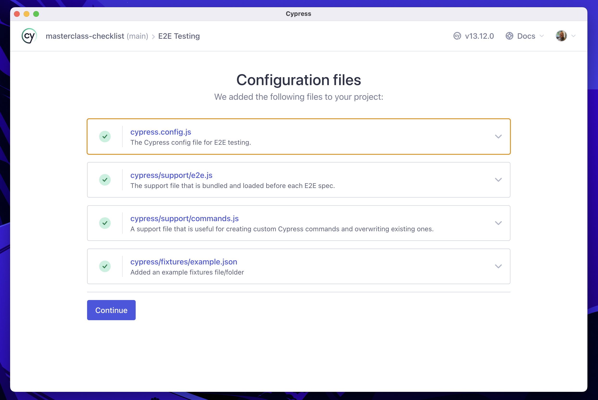

# masterclass-checklist

Automated testing project for the Cypress Checklist application developed by TAT.

## Pre-requirements

It is required to have Node.js and npm installed to run this project.

> I used versions `v20.13.1` and `10.8.1` of Node.js and npm, respectively. I suggest you use the same or later versions.

## Installation

Run `npm install` (or `npm i` for the short version) to install the dev dependencies.

## Tests

> **Note:** Before running the tests, make a copy of the `cypress.env.example.json` file as `cypress.env.json`, which in the real world, you would update with valid credentials.
>
> The `cypress.env.json` file is included on [`.gitignore`](./.gitignore) and you're safe that confidential info won't be versioned.

Run `npm test` (or `npm t` for the short version) to run the test in headless mode.

Or, run `npm run cy:open` to open Cypress in interactive mode.

### Cypress files and folders structure

To understand more about the Cypress files and folders structure, see the below image.

Besides that, we also use the following files and folders...

## Support this project

If you want to support this project, leave a ⭐.

___

This project was created with 💚 by [Walmyr](https://walmyr.dev).

